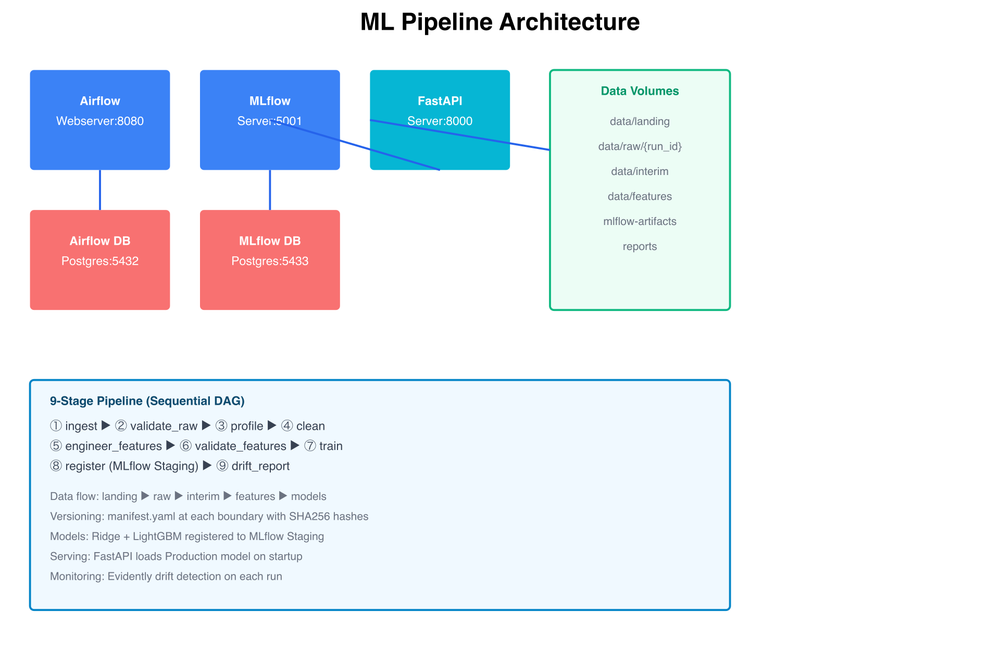
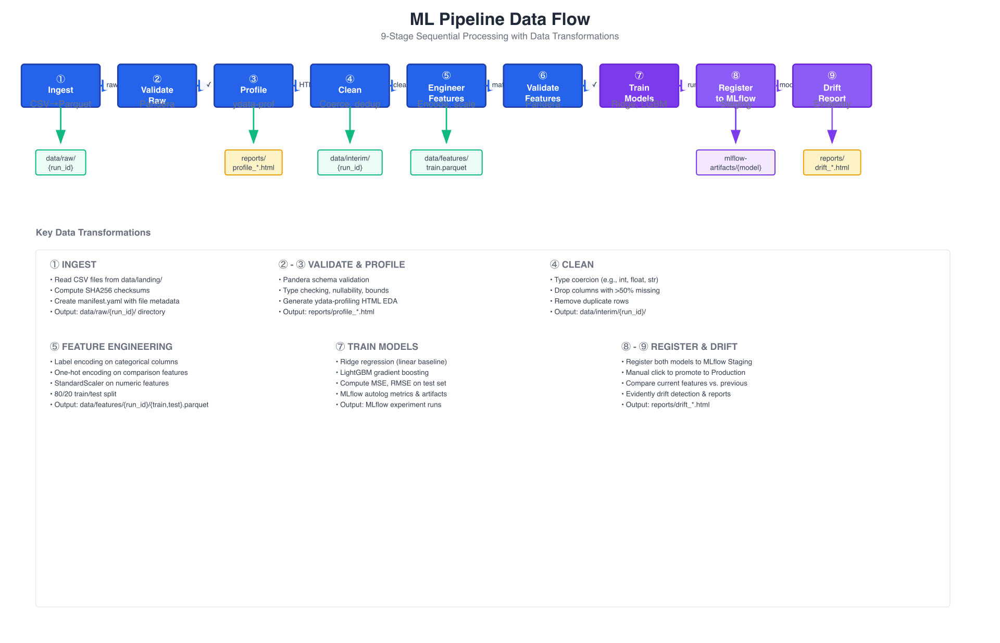
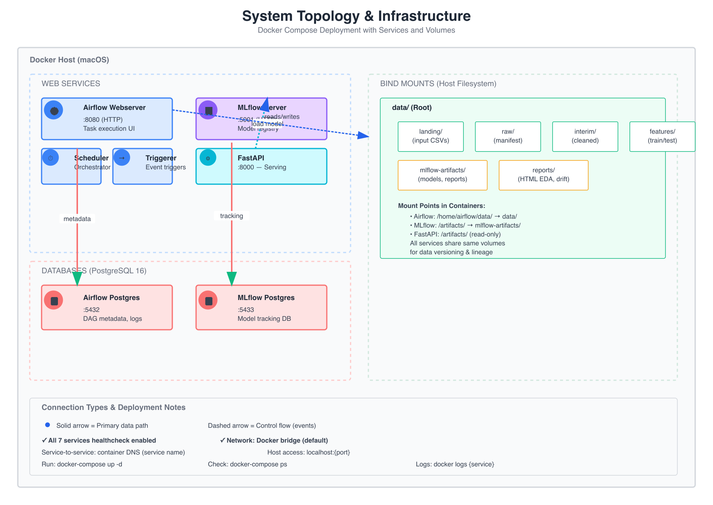

# ML Pipeline POC — Technical Diagrams

All 4 technical diagrams are generated as production-quality PNG files (1920px width, 2x retina) in the `diagrams/` directory.

## 1. Architecture Diagram
**File**: `diagrams/01-architecture.png`

**Shows**: 
- All 7 Docker services and their roles
- Webserver, Scheduler, Triggerer (Airflow)
- MLflow Server, FastAPI Server
- Two PostgreSQL instances (Airflow metadata, MLflow tracking)
- Bind-mounted data volumes (landing, raw, interim, features, artifacts, reports)
- Service dependencies and data flow

**Use case**: System overview, deployment documentation, stakeholder presentations

---

## 2. Data Flow Diagram
**File**: `diagrams/02-data-flow.png`

**Shows**: 
- All 9 pipeline stages in sequence
- Data transformations at each stage:
  - ① Ingest: CSV → Parquet with checksums
  - ② Validate Raw: Pandera schema validation
  - ③ Profile: ydata-profiling HTML reports
  - ④ Clean: Type coercion, deduplication
  - ⑤ Engineer Features: Encoding, scaling, train/test split
  - ⑥ Validate Features: Schema check on feature matrix
  - ⑦ Train Models: Ridge + LightGBM with MLflow autolog
  - ⑧ Register: Models to MLflow Staging (manual promotion to Production)
  - ⑨ Drift Report: Evidently AI drift detection
- Output paths for each stage
- Key transformations summary table

**Use case**: Understanding pipeline stages, troubleshooting data flow, TESTING.md reference

---

## 3. System Topology
**File**: `diagrams/03-system-topology.png`

**Shows**:
- Infrastructure layers: Orchestration, ML Tracking/Serving, Data Storage
- Service placement within Docker Host
- Database connections and metadata flow
- Bind-mount volume structure and mount points
- Network connections between services
- Port mappings and service accessibility
- Connection types (solid = primary data, dashed = control flow)

**Use case**: Infrastructure documentation, DevOps deployment guides, volume mapping reference

---

## 4. Agent Architecture
**File**: `diagrams/04-agent-architecture.png`

**Shows**:
- Input layer: Trigger events and context (run_id, config)
- Agent core: Planner, DAG graph, execution engine
- Iterative execution loop (execute → check → decide next → repeat)
- Memory layers:
  - Working memory: XCom (ephemeral, current run)
  - Short-term memory: PostgreSQL metadata DB (logs, history)
  - Long-term memory: File system manifests (immutable versioning)
- Tool execution layer: All 9 pipeline stages as tools
- Output and side effects: Data versioning, model registration

**Use case**: Understanding orchestration patterns, agentic concepts, system design presentations

---

## Embedding in Documentation

### In README.md
```markdown


See [DIAGRAMS.md](DIAGRAMS.md) for all technical diagrams.
```

### In TESTING.md
```markdown


The 9-stage pipeline processes data sequentially...
```

### In ARCHITECTURE.md
```markdown


All 7 services run in Docker Compose with bind-mounted volumes...
```

---

## Regenerating Diagrams

To regenerate the SVG source files (before PNG conversion):

```bash
cd diagrams

# Each diagram was generated using Python SVG generation
# SVG files are in diagrams/0{1-4}-*.svg

# To convert SVG → PNG (requires rsvg-convert):
rsvg-convert -w 1920 01-architecture.svg -o 01-architecture.png
```

### Tools Used
- **Generator**: Python (lines-based SVG generation)
- **Validator**: rsvg-convert
- **Export**: rsvg-convert -w 1920 (1920px width = 2x retina)
- **Style**: Flat Icon style (reference: style-1-flat-icon.md)

---

## Color Scheme

All diagrams use consistent color coding:

| Color | Meaning |
|-------|---------|
| **Blue** (#3b82f6) | Services, computation, primary components |
| **Orange** (#f87171) | Databases, storage |
| **Purple** (#8b5cf6) | ML models, experiment tracking |
| **Cyan** (#06b6d4) | API/serving layer |
| **Green** (#10b981) | Data, volumes, successful flows |
| **Yellow** (#fbbf24) | Reports, artifacts |

---

## Quick Reference

- **Architecture**: Show stakeholders
- **Data Flow**: Debug pipeline, verify stage outputs
- **System Topology**: Understand volumes, mounts, networking
- **Agent Architecture**: Learn orchestration design, multi-tier memory

---

**Generated**: 2026-05-18  
**PNG Format**: 1920×height @ 2x retina (3.84px/mm)  
**All files**: diagrams/0{1-4}-*.{svg,png}
